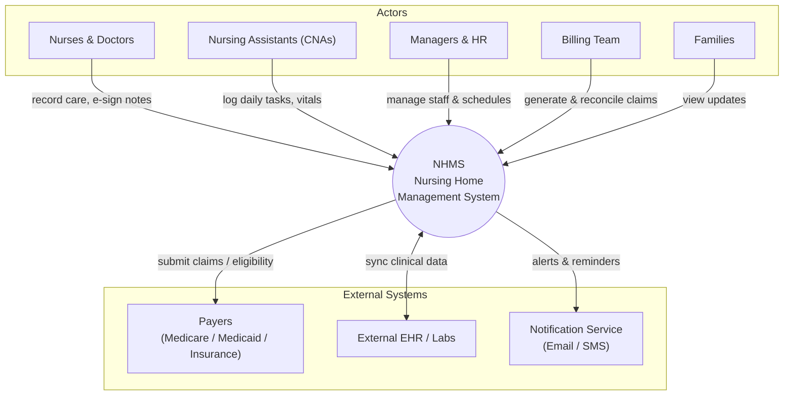

# NHMS — System Context Diagram

> **Stage:** Discovery / Requirements Analysis
> **Status:** Draft (WIP)
> **Diagram type:** System Context Diagram (level-0 view of actors ↔ NHMS ↔ external systems)
> **Author:** Kiều Quang Vân (`@unkaidev`)
> **Sprint / Day:** Sprint 1 · Day 3 (2026-06-26)
> **Source:** `docs/unkaidev/day3/nhms-business-analysis-document-v1.0.md` (BAD v1.0)

A high-level context diagram showing the Nursing Home Management System (NHMS)
as a single platform, the human actors who interact with it, and the external
systems it exchanges data with.

## Diagram (Mermaid)

## Notes

- Level-0 (context) scope only — internal modules (Intake, Care Plans, Scheduling,
  Billing, Safety) are detailed in the BAD and future BPMN diagrams.
- TODO: export a `.png`/`.pdf` of the rendered diagram to attach alongside this source.
